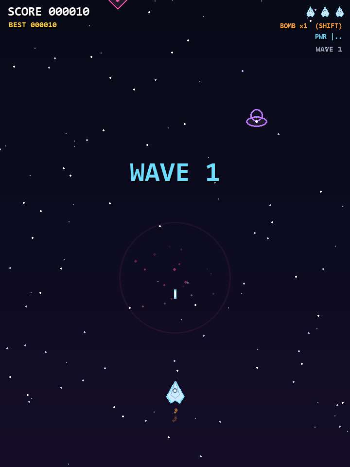

# Neon Blaster 🚀

A vertical space shooter in Python — the third game in the Neon series
(after the highway racer [neon-rush](https://github.com/sarthakpol7117-droid/neon-rush)
and [ox-game](https://github.com/sarthakpol7117-droid/ox-game)).

Your guns fire automatically — your job is to dodge. Survive escalating waves,
fight the Dreadnought boss every 5th wave, and grab power-ups. Everything
(ships, bullets, explosions, sounds) is generated in code — no asset files,
no dependencies beyond `pygame`.



## Requirements

- Python 3.8+
- pygame 2.x — `pip install pygame`

## Run it

```
python neon_blaster.py
```

On Windows you can also double-click `run.bat`.

## Controls

| Input | Action |
| --- | --- |
| ← / → / ↑ / ↓ or WASD | fly |
| SPACE (nothing!) | guns fire automatically |
| SHIFT or B | smart bomb — wipes bullets, damages every enemy |
| P | pause |
| M | mute / unmute |
| ESC | pause → menu → quit |
| ENTER | start / retry |

## Enemies & power-ups

| Enemy | Behaviour |
| --- | --- |
| Grunt (pink) | drifts down, sways |
| Weaver (green) | fast, wide sine sweeps |
| Shooter (purple) | holds position and fires aimed shots |
| Tank (orange) | slow, 6 HP, worth the effort |
| Dreadnought (boss) | 3 attack patterns: aimed spread, bullet ring, bullet rain |

| Drop | Effect |
| --- | --- |
| **P** (cyan) | weapon upgrade — single → twin → triple + side shots (max +150 pts) |
| **S** (green) | shield — absorbs one hit |
| **B** (orange) | +1 smart bomb |
| **+** (pink) | +1 life |

Each cleared wave pays a bonus; each hit costs a life with a short shield
window. High score is saved to `highscore.json`.

## Features

- Parallax starfield, neon bullets, explosion rings and particles
- Screen shake, hit slow-motion, smart-bomb flash
- Escalating infinite waves with a boss fight every 5th wave and a health bar
- Synthesized sound effects (zaps, booms, chimes) — no audio files
- Menu, pause, and game-over stats (score, wave reached, kills, new-best flair)
- Headless selftest: `python neon_blaster.py --selftest` verifies combat,
  power-ups, bombs, hits, boss spawn/kill and game over, then writes
  screenshots to `shots/` (never touches your real high score)

## Files

- `neon_blaster.py` — the whole game (single file)
- `run.bat` — Windows launcher
- `highscore.json` — your best score (created automatically)
- `shots/` — screenshots generated by the selftest
